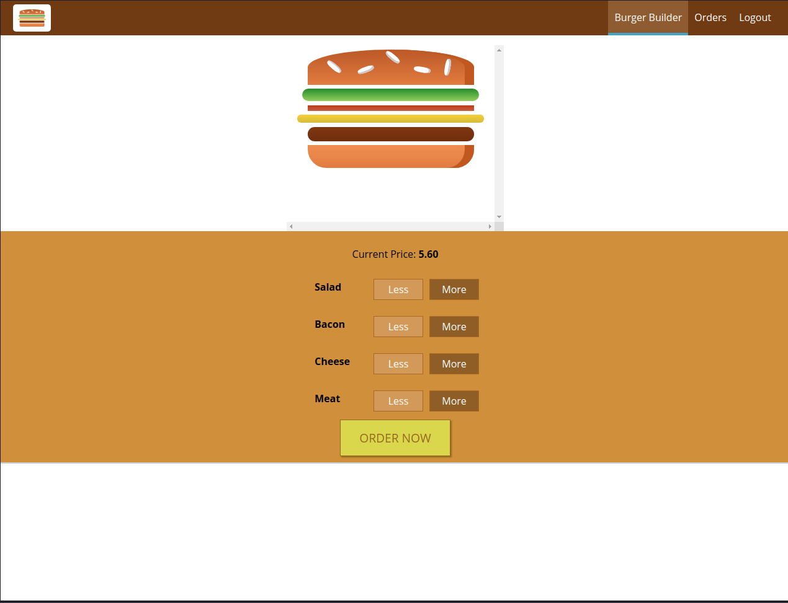
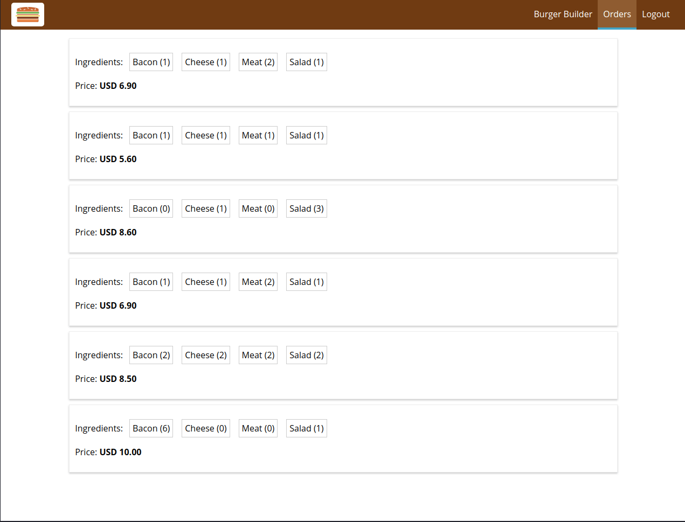

# React - The Complete Guide (incl Hooks, React Router, Redux)

<h1 align="center">
    
    
    
    
    
</h1>

## 💻 Projeto

Projeto desenvolvido no curso "[React - The Complete Guide (incl Hooks, React Router, Redux), created by Academind by Maximilian Schwarzmüller](https://www.udemy.com/course/react-the-complete-guide-incl-redux/)" da [Udemy](https://www.udemy.com/).

Burger Builder é um projeto em que você monta seu hamburger e envia seu pedido para API (Firebase).

## :rocket: Tecnologias

Esse projeto foi desenvolvido com as seguintes tecnologias:

- [Node.js](https://nodejs.org/en/)
- [React](https://pt-br.reactjs.org/)

## :information_source: Como usar

Para clonar essa aplicação, você vai precisar de [Git](https://git-scm.com/), Node.js v8+ e [NPM](https://www.npmjs.com/) instalado.

### Iniciar Projeto

```bash
# Instalar dependências
npm install

# Iniciar projeto na porta 3000
npm start
```
